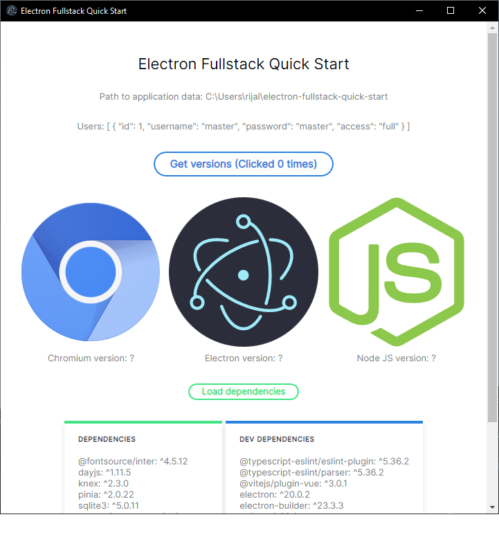

# Electron Fullstack Quick Start (Vuestic as UI Libary)


Based on [electron-vite](https://github.com/electron-vite/electron-vite-vue)

### Preview


### Build with:
- Typescript
- JS Framework: [Vue 3](https://github.com/vuejs/vue)
- State Management: [Pinia](https://github.com/vuejs/pinia)
- Bundle Tooling: [Vite](https://github.com/vitejs/vite)
- UI Library & Components: [Vuestic UI](https://github.com/epicmaxco/vuestic-ui)
- Icons: Material Design Icons
- Database: Sqlite3
- Query Builder: [Knex](https://github.com/knex/knex)
- Logging: [Winston](https://github.com/winstonjs/winston)
- DateTime library: [dayjs](https://github.com/iamkun/dayjs)
- Font : Google Font Inter
- Application Builder: [Electron-builder](https://github.com/electron-userland/electron-builder)
### Features
- Using Vue 3 Composition API
- Using Context Isolation

## Usage
1. Clone this repo
```bash
git clone https://github.com/aufarijaal/electron-fullstack-quick-start-vuestic
```
2. Go to directory
```bash
cd electron-fullstack-quick-start-vuestic
```
3. Install dependencies and run the development server
```bash
yarn && yarn dev
```
## Recommended IDE Setup
Extension:
- Volar
- Prettier
- ESLint

### Note:
By default this ESLint configuration is forcing you to use `double quote` and `semicolon`. change the config if you don't want to.

## HOW TO?

**How to change icon**: replace icon in `public` folder with same name as `icon.ico`. size must be at least 256x256.
<br/>
<br/>
**How to change application data directory**: By default, application data placed in `$HOME/electron-fullstack-quick-start`. to change, edit the `appDirectory` value in `knexfile/sqlite/knexfile.ts` to your preference. it will automatically created if not exists by the `winston` library ability.

## OTHER UI OPTIONS
There are some other ui library options for this template. Check below.
- [Electron Fullstack Quick Start (Element Plus)](https://github.com/aufarijaal/electron-fullstack-quick-start)