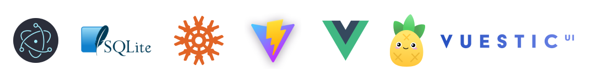

# Electron Fullstack Quick Start



Based on [electron-vite](https://github.com/electron-vite/electron-vite-vue)

### Preview


### Build with:
- Typescript
- JS Framework: [Vue 3](https://github.com/vuejs/vue)
- State Management: [Pinia]()
- Bundle Tooling: [Vite](https://github.com/vitejs/vite)
- UI Library & Components: [Element Plus](https://github.com/element-plus/element-plus)
- Icons: [Element Plus Icons](https://github.com/element-plus/element-plus-icons)
- Database: Sqlite3
- Query Builder: [Knex](https://github.com/knex/knex)
- Logging: [Winston](https://github.com/winstonjs/winston)
- DateTime library: [dayjs](https://github.com/iamkun/dayjs)
- Font (Google font Inter) using [vfonts](https://github.com/07akioni/vfonts)
- Application Builder: [Electron-builder](https://github.com/electron-userland/electron-builder)
### Features
- Using Vue 3 Composition API
- Using Context Isolation
- Light & Dark Theme Support

## Usage
1. Clone this repo
```bash
git clone https://github.com/aufarijaal/electron-fullstack-quick-start.git
```
2. Go to directory
```bash
cd electron-fullstack-quick-start
```
3. Install dependencies and run the development server
```bash
yarn && yarn dev
```
## Recommended IDE Setup
Extension:
- Volar
- Prettier
- ESLint

### Note:
By default this ESLint configuration is forcing you to use `double quote` and `semicolon`. change the config if you don't want to.

## HOW TO?

**How to change icon**: replace icon in `public` folder with same name as `icon.ico`. size must be at least 256x256.
<br/>
<br/>
**How to change application data directory**: By default, application data placed in `$HOME/electron-fullstack-quick-start`. to change, edit the `appDirectory` value in `knexfile/sqlite/knexfile.ts` to your preference. it will automatically created if not exists by the `winston` library ability.